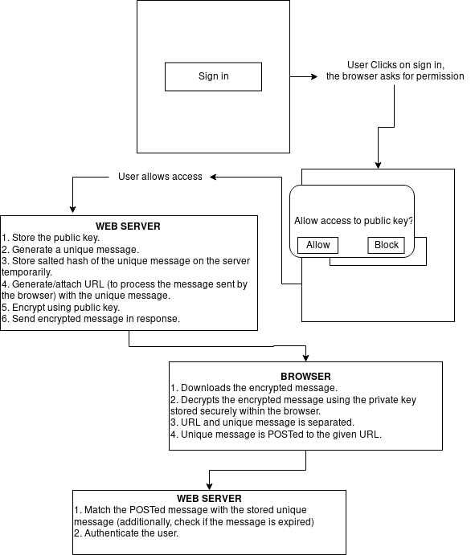

# Password Less
A prototype demonstrating Digital Signature based authentication system.

## Digital Signature Based Authentication System
PGP like encryption programs used in digitally signing data are best for authenticating users. Presently, websites depend on some arbitrary signing process like username-password combinations or otp sent in email or sms which acts like a digital signature but not truly is. Digital Signature based authentication system aims to provide a true method of signing in. 

